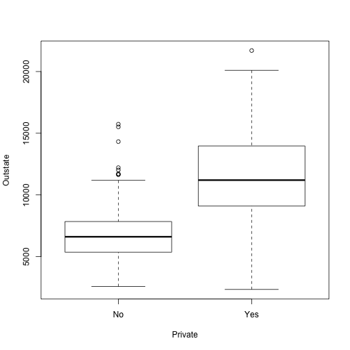
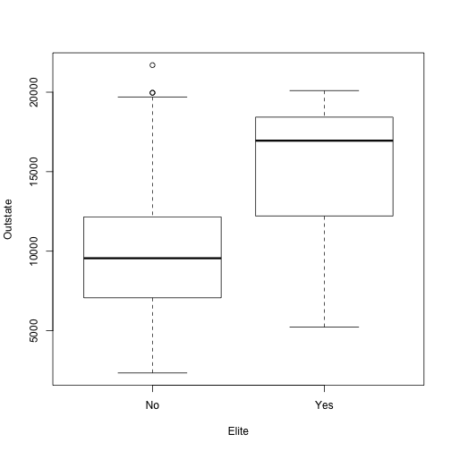
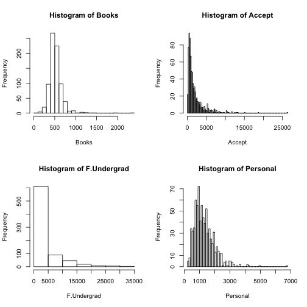
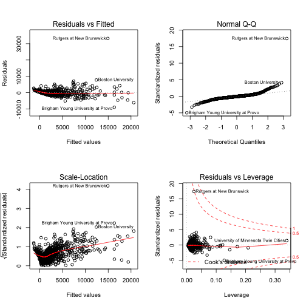
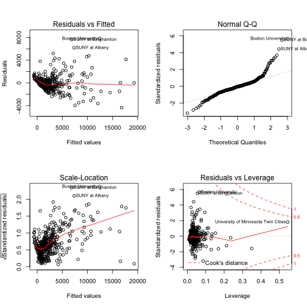

Homework 1 for STATS216 by Bruno Pen Wu
========================================================

Question 1
----------

a) A **flexible method is better** in this case since it can take advantage of the extremely large sample size.

b) An **inflexible method is better** in this case. Since the sample size is small, a more flexible model might run into the problem of *overfitting* and would probably have a *large variance* as a change in any of the data points will have more of an impact on $\hat f$.

c) An **inflexible method is better** in this case. Since the variance of the error terms, $\mbox{Var}(\epsilon)$ is very high, it will likely cause a very flexible model to *overfit* as the flexible model will follow the "noise" too closely.

d) A **flexible method is better** in this case. All else being equal, a more flexible model would capture a non-linear relationship (between response and predictors) better than an inflexible model (i.e. have a *lower bias* than an inflexible model). Since in this case, the $\sigma^2$ is small also, overfitting shouldn't be an issue - hence, another reason to use a more flexible model in this case.

e) An **inflexible method is better** in this case. Although a more flexible model would (all else being equal) capture the highly non-linear relationship better, there is a problem in this case since the $\sigma^2$ is large. This would mean that a flexible model will have a very high likelihood of *overfitting* the data, causing the $\hat f$ to follow the "noise" too much. Hence, an inflexible method is probably better for this case.

Question 2
----------

a) **Regression** - response is CEO salary and predictors are profit, number of employees, and industry. This is modeling for an **inference** since we are interested to find out which input variables affect the response, rather than to predict the value of the response itself. **n = 500 and p = 3**.

b) **Unsupervised learning and classification** - Seems like there are two steps in the process to build a recommendation model. First, we need to use the set of unlabeled data we have (the ratings) to come up with some "meaningful segmentation" for the customers and the restaurants. This step involves both classification (using some kind of nearest neighbors perhaps to discern if there are "meaningful groups") and unsupervised learning (since we don't know the outcomes we are predicting - i.e. we don't know the number and type of "meaningful groupings" beforehand). Once we have determined these "meaningful groups", we can use them as predictors in the second step to build our recommendation model. The recommendation model is also a classification problem since the response is qualitative (to recommend or not). The recommendation model is a **prediction** as we are interested in the value of the response (to recommend or not). **n = 10,000 customers x 100 restuarants = 1,000,000 observations and p is unknown (we need to figure out what the predictors are using classification and unsupervised learning.**

c) **Classification** - since the response is qualitative (a *success* of a *failure*), this is a classification problem. This is modeling for a **prediction** since we are interested in the value of the response (whether the new product launch will be a success of a failure) given the test set (our new product). **n = 20 and p = 13 (price, marketing budget, competition price, and 10 other variables)**

d) **Regression** - the response is % change in US dollar and the predictors are % changes in the US stock market, the British market, and the German market. This is modeling for an **prediction** as we are mainly interested the value of the response (% change in US dollar) rather than how each of the individual variables (e.g. % in the US stock market) affects the dollar. **n = 52 (52 weeks of 2012) and p=3 (% changes in US, British and German markets).**

Question 3
----------

a) 3 examples of classification:
  1. **Hiring decision**
    * Response: Good fit with company or not a good fit
    * Predictors: Work history, education, income, age, leadership potential, IQ, EQ, culture, personality, etc.
    * Goal: Prediction - predict whether candidate will be a good fit at the firm
  2. **Airplanes preventative maintenance for safety and cost-savings**
    * Response: Pass or need maintenance
    * Predictors: Age, hours of flight, number of prior repairs, existing damages, size of craft, number of passengers handled, flight routes, etc.
    * Goal: Prediction - predict if an aircraft is ready for maintenance
  3. **Credit approval process**
    * Response: Will default or will not default
    * Predictors: Payment history, debt balance, income, wealth, marital status, age
    * Goal: Prediction - to predict whether a loan should be approved

b) 3 examples of regression:
  1. **GDP**
    * Response: GDP
    * Predictors: Savings, Investment, Consumption, Government Spending, etc.
    * Goal: Inference - to determine which factors are critical to increase the economic outputs of a country. 
  2. **Population of endangered animals in an area**
    * Response: Population of endangered animal
    * Predictors: Size of human population in the area, amount and types of development, industrialization, pollution level, number and type of predators, birth rate, death rate, etc.
    * Goal: Inference - to determine which factors are important to enhance the probability of survival for an endangered specie.
  3. **Amount of potential foot traffic in a new area for real estate development**
    * Response: Amount of foot traffic
    * Predictors: Population size and density, transportation options and distance, income, walkability, climate, indoor/outdoor facilities, residential/CBD/industrial, neighboring facilities, etc.
    * Goal: Prediction - predict the amount of foot traffic in a new area in order to determine how much retail development is suitable and what rent to charge tenants.

c) 3 examples of unsupervised learning that might be useful:
  1. **Predict which stocks will go up given a host of macroeconomic, industry, and company-specific data.**
  2. **Determine what kind of car a buyer will be interested in given prior purchasing history and demographics.**
  3. **Determine where crime will likely take place given prior crime data.**

Question 4
----------

a) Reading the data:

```r
college = read.csv("College.csv")
```


b) Fix the first column (college names):

```r
rownames(college) = college[, 1]
college = college[, -1]
```


c) i. Use `summary()` function

```r
summary(college)
```

```
##  Private        Apps           Accept          Enroll       Top10perc   
##  No :212   Min.   :   81   Min.   :   72   Min.   :  35   Min.   : 1.0  
##  Yes:565   1st Qu.:  776   1st Qu.:  604   1st Qu.: 242   1st Qu.:15.0  
##            Median : 1558   Median : 1110   Median : 434   Median :23.0  
##            Mean   : 3002   Mean   : 2019   Mean   : 780   Mean   :27.6  
##            3rd Qu.: 3624   3rd Qu.: 2424   3rd Qu.: 902   3rd Qu.:35.0  
##            Max.   :48094   Max.   :26330   Max.   :6392   Max.   :96.0  
##    Top25perc      F.Undergrad     P.Undergrad       Outstate    
##  Min.   :  9.0   Min.   :  139   Min.   :    1   Min.   : 2340  
##  1st Qu.: 41.0   1st Qu.:  992   1st Qu.:   95   1st Qu.: 7320  
##  Median : 54.0   Median : 1707   Median :  353   Median : 9990  
##  Mean   : 55.8   Mean   : 3700   Mean   :  855   Mean   :10441  
##  3rd Qu.: 69.0   3rd Qu.: 4005   3rd Qu.:  967   3rd Qu.:12925  
##  Max.   :100.0   Max.   :31643   Max.   :21836   Max.   :21700  
##    Room.Board       Books         Personal         PhD       
##  Min.   :1780   Min.   :  96   Min.   : 250   Min.   :  8.0  
##  1st Qu.:3597   1st Qu.: 470   1st Qu.: 850   1st Qu.: 62.0  
##  Median :4200   Median : 500   Median :1200   Median : 75.0  
##  Mean   :4358   Mean   : 549   Mean   :1341   Mean   : 72.7  
##  3rd Qu.:5050   3rd Qu.: 600   3rd Qu.:1700   3rd Qu.: 85.0  
##  Max.   :8124   Max.   :2340   Max.   :6800   Max.   :103.0  
##     Terminal       S.F.Ratio     perc.alumni       Expend     
##  Min.   : 24.0   Min.   : 2.5   Min.   : 0.0   Min.   : 3186  
##  1st Qu.: 71.0   1st Qu.:11.5   1st Qu.:13.0   1st Qu.: 6751  
##  Median : 82.0   Median :13.6   Median :21.0   Median : 8377  
##  Mean   : 79.7   Mean   :14.1   Mean   :22.7   Mean   : 9660  
##  3rd Qu.: 92.0   3rd Qu.:16.5   3rd Qu.:31.0   3rd Qu.:10830  
##  Max.   :100.0   Max.   :39.8   Max.   :64.0   Max.   :56233  
##    Grad.Rate    
##  Min.   : 10.0  
##  1st Qu.: 53.0  
##  Median : 65.0  
##  Mean   : 65.5  
##  3rd Qu.: 78.0  
##  Max.   :118.0
```

  ii. Use `pairs()` function for the first 10 columns of data

```r
pairs(college[, 1:10])
```

 

  iii. Use `plot()` to create side-by-side boxplots of `Outstate` versus `Private`.

```r
attach(college)
plot(Outstate ~ Private, xlab = "Private", ylab = "Outstate")
```

 

  iv. Create new variable called `Elite`.

```r
Elite = rep("No", nrow(college))
Elite[Top10perc > 50] = "Yes"  # The 'Elite' vector will have a 'Yes' whenever Top10perc is >50%
Elite = as.factor(Elite)
college = data.frame(college, Elite)  #append the 'Elite' vector to the 'college' matrix
```

  Use `summary()` function to see how many elite universities there are:

```r
summary(Elite)
```

```
##  No Yes 
## 699  78
```

  **There are 78 elite universities.**
  
  Use `plot()` to produce side-by-side boxplots of `Outstate` and `Elite`:

```r
plot(Outstate ~ Elite, xlab = "Elite", ylab = "Outstate")
```

 

  v. Use `hist()` to produce a few histograms with differing numbers of bins

```r
par(mfrow = c(2, 2))  #divide the print window into 4 regions
hist(Books, breaks = 30)
hist(Accept, breaks = 100)
hist(F.Undergrad, breaks = 10)
hist(Personal, breaks = 50)
```

 


Question 5
----------

a) Split the data set into training and test set of approx equal size:

```r
set.seed(5)  #set seed first so that the sample() function will pick the same set of rows each time. This is better for reproducible results.
indexes = sample(1:nrow(college), size = 0.5 * nrow(college))  #use sample() function to select rows from the original dataset
college.train = college[indexes, ]  #use the selected rows for the training set
college.test = college[-indexes, ]  #use the remaining rows for the test set
```


b) Fit a linear model on the training set. Exclude `Elite`, `Accept`, and `Enroll` predictors. Report on the training and test errors.

```r
lm.train = lm(Apps ~ . - Enroll - Accept - Elite, data = college.train)  #fit a linear model on the training set
```


**The Mean Square Error for the training set is:**

```r
mean((college.train$Apps - predict(lm.train, data.frame(college.train)))^2)
```

```
## [1] 1943822
```


**Mean Square Error for the test set is:**

```r
mean((college.test$Apps - predict(lm.train, data.frame(college.test)))^2)
```

```
## [1] 5591710
```


c) Comment on the results: The test set MSE is much higher than the training set MSE. There might be ways to lower the test set MSE by improving the model itself and to make sure that outliers are excluded. Since outliers can reside in either the training set or the test set, I decided to run a regression on the *entire set* and run diagnostics on the *entire set* to see where the biggest outliers are.

```r
lm.entire = lm(Apps ~ . - Enroll - Accept - Elite, data = college)  #regression on the entire data set 
# get diagnostic on outliers/high leverage points
par(mfrow = c(2, 2))
plot(lm.entire)
```

 


As can be seen from the "Residuals vs Fitted" plot, "Rutgers at New Brunswick" is clearly an outlier. So if we excluded it from our data set, it will prob lower the test MSE. It turns out that the "Rutgers" data point is in the test data set. So I proceeded to remove it by creating a new test data set (without Rutgers).


```r
college.test2 = college.test[-230, ]  #230th row is where Rutgers is in the test set

# Now I can run the Mean Square Error again for the new test set to see if
# removing the outlier helped.
mean((college.test2$Apps - predict(lm.train, data.frame(college.test2)))^2)
```

```
## [1] 2764421
```

The test set MSE now dropped from 5591710 to 2764421. 

Next, we can try to improve on the training model itself. We can check for non-linearity by looking at diagnostic plot. 


```r
par(mfrow = c(2, 2))
plot(lm.train)
```

 


Doesn't look like non-lineariy is a big issue.

We can then look at which predictors are the most important and only include the most statistically significant ones to obtain a more effective model.


```r
summary(lm.train)
```

```
## 
## Call:
## lm(formula = Apps ~ . - Enroll - Accept - Elite, data = college.train)
## 
## Residuals:
##    Min     1Q Median     3Q    Max 
##  -4362   -664    -74    471   7803 
## 
## Coefficients:
##              Estimate Std. Error t value Pr(>|t|)    
## (Intercept) -2.48e+03   7.94e+02   -3.13   0.0019 ** 
## PrivateYes  -1.73e+02   2.74e+02   -0.63   0.5284    
## Top10perc   -1.25e+00   1.12e+01   -0.11   0.9107    
## Top25perc    1.25e+01   8.47e+00    1.47   0.1420    
## F.Undergrad  6.50e-01   2.41e-02   27.03  < 2e-16 ***
## P.Undergrad -5.88e-02   5.55e-02   -1.06   0.2894    
## Outstate     3.36e-02   3.84e-02    0.88   0.3813    
## Room.Board   3.89e-01   9.78e-02    3.97  8.6e-05 ***
## Books        2.63e-01   4.69e-01    0.56   0.5755    
## Personal    -2.86e-01   1.30e-01   -2.20   0.0287 *  
## PhD          6.24e+00   9.03e+00    0.69   0.4897    
## Terminal    -1.55e+01   9.47e+00   -1.63   0.1031    
## S.F.Ratio    2.34e+01   2.45e+01    0.95   0.3412    
## perc.alumni -1.75e+01   7.65e+00   -2.28   0.0230 *  
## Expend       7.27e-02   2.68e-02    2.71   0.0070 ** 
## Grad.Rate    1.37e+01   5.77e+00    2.38   0.0180 *  
## ---
## Signif. codes:  0 '***' 0.001 '**' 0.01 '*' 0.05 '.' 0.1 ' ' 1
## 
## Residual standard error: 1420 on 372 degrees of freedom
## Multiple R-squared:  0.826,	Adjusted R-squared:  0.819 
## F-statistic:  117 on 15 and 372 DF,  p-value: <2e-16
```


**From looking at the p-values of the variables, only a few are statistically significant: `F.Undergrad`,`Room.Board`,`Expend`,`Grad.Rate`.** So I ran a regression on the training set for the statistically significant factors only and included an interaction term for `Room.Board` and `Expend` since room and board expenses would prob be higher in schools where there are higher expenditures for students.


```r
lm.train2 = lm(Apps ~ F.Undergrad + Room.Board * Expend + Grad.Rate, data = college.train)
summary(lm.train2)
```

```
## 
## Call:
## lm(formula = Apps ~ F.Undergrad + Room.Board * Expend + Grad.Rate, 
##     data = college.train)
## 
## Residuals:
##    Min     1Q Median     3Q    Max 
##  -3905   -575    -87    397   8231 
## 
## Coefficients:
##                    Estimate Std. Error t value Pr(>|t|)    
## (Intercept)       -1.08e+03   6.75e+02   -1.60  0.10940    
## F.Undergrad        6.44e-01   1.60e-02   40.36  < 2e-16 ***
## Room.Board         1.90e-02   1.48e-01    0.13  0.89756    
## Expend            -1.47e-01   6.50e-02   -2.26  0.02462 *  
## Grad.Rate          1.62e+01   4.90e+00    3.30  0.00105 ** 
## Room.Board:Expend  4.35e-05   1.25e-05    3.48  0.00057 ***
## ---
## Signif. codes:  0 '***' 0.001 '**' 0.01 '*' 0.05 '.' 0.1 ' ' 1
## 
## Residual standard error: 1420 on 382 degrees of freedom
## Multiple R-squared:  0.822,	Adjusted R-squared:  0.819 
## F-statistic:  352 on 5 and 382 DF,  p-value: <2e-16
```


The R-square for this new regression is almost exactly the same as the R-square for the previous regression which included all of the variables while the MSEs for the test set for these regressions are almost exactly the same. As an aside, even though the p-values for `Room.Board` and `Expend` became a lot less significant individually, according to the **hierarchical principle**, because their interactive term is present and is significant, we have to include the *main effects* as well. 

d) Logistic regression. 

First, we need to set up a new outcome variable (by adding a new column to the entire data set) that would be 1 when # apps >= median and 0 when # apps < median. Then we can run the logistics regression using this new outcome variable.


```r
# Create a new 'ManyApps' variable and populating with all 0's
ManyApps = rep(0, nrow(college))
# Put in 1's for when # of apps >= the overall median # of apps
ManyApps[college$Apps >= median(college$Apps)] = 1
# Create a new logistics data set with additional 'ManyApps' column
college.glm = data.frame(college, ManyApps)
```


We can now set up the training and test data sets as before:

```r
college.glm.train = college.glm[indexes, ]  #using the same set of rows as in linear regression for the training set
college.glm.test = college.glm[-indexes, ]
```


Take out the outlier from the test data set as we did in the linear regression:

```r
college.glm.test2 = college.glm.test[-230, ]  #230th row is where the outlier (Rutgers at New Brunswick) is in the test set
```


Now we can run the regression. First using all the variables (except the 3 that were asked to be excluded):

```r
glm.train = glm(ManyApps ~ . - Enroll - Accept - Elite, data = college.glm.train, 
    family = binomial)
```

```
## Warning: glm.fit: algorithm did not converge
## Warning: glm.fit: fitted probabilities numerically 0 or 1 occurred
```


Take a look at which variables are significant:

```r
summary(glm.train)
```

```
## 
## Call:
## glm(formula = ManyApps ~ . - Enroll - Accept - Elite, family = binomial, 
##     data = college.glm.train)
## 
## Deviance Residuals: 
##       Min         1Q     Median         3Q        Max  
## -0.000551   0.000000   0.000000   0.000000   0.000418  
## 
## Coefficients:
##              Estimate Std. Error z value Pr(>|z|)
## (Intercept) -5.88e+02   2.74e+04   -0.02     0.98
## PrivateYes  -2.09e+01   1.30e+04    0.00     1.00
## Apps         3.90e-01   1.69e+01    0.02     0.98
## Top10perc   -4.66e+00   7.50e+02   -0.01     1.00
## Top25perc    3.21e+00   5.92e+02    0.01     1.00
## F.Undergrad -5.22e-05   5.91e+00    0.00     1.00
## P.Undergrad  1.98e-02   1.99e+01    0.00     1.00
## Outstate    -2.58e-03   1.40e+00    0.00     1.00
## Room.Board  -4.57e-03   3.98e+00    0.00     1.00
## Books       -6.71e-03   2.61e+01    0.00     1.00
## Personal     1.18e-02   8.18e+00    0.00     1.00
## PhD         -2.26e-01   3.87e+02    0.00     1.00
## Terminal     1.25e+00   5.45e+02    0.00     1.00
## S.F.Ratio   -4.82e+00   8.00e+02   -0.01     1.00
## perc.alumni  2.38e+00   5.08e+02    0.00     1.00
## Expend      -6.23e-03   1.13e+00   -0.01     1.00
## Grad.Rate   -7.45e-01   1.48e+02   -0.01     1.00
## 
## (Dispersion parameter for binomial family taken to be 1)
## 
##     Null deviance: 5.3787e+02  on 387  degrees of freedom
## Residual deviance: 1.5660e-06  on 371  degrees of freedom
## AIC: 34
## 
## Number of Fisher Scoring iterations: 25
```


It turns out that none of the variables are statistically significant using this logistics regression *when all of the variables included*. So we'll need to improve on this model first before looking at diagnostics. 

To improve effectiveness of the model, we could exclude the `Apps` variable. Since the `Apps` variable is highly correlated with the `ManyApps` variable (in fact it's used to generate the `ManyApps` variable), we should exclude it from the regression:

```r
glm.train2 = glm(ManyApps ~ . - Enroll - Accept - Elite - Apps, data = college.glm.train, 
    family = binomial)
```

```
## Warning: glm.fit: fitted probabilities numerically 0 or 1 occurred
```


Take a look at which variables are significant:

```r
summary(glm.train2)
```

```
## 
## Call:
## glm(formula = ManyApps ~ . - Enroll - Accept - Elite - Apps, 
##     family = binomial, data = college.glm.train)
## 
## Deviance Residuals: 
##     Min       1Q   Median       3Q      Max  
## -2.3358  -0.3423  -0.0244   0.1147   2.8906  
## 
## Coefficients:
##              Estimate Std. Error z value Pr(>|z|)    
## (Intercept) -9.49e+00   2.45e+00   -3.87  0.00011 ***
## PrivateYes  -4.42e-02   8.94e-01   -0.05  0.96056    
## Top10perc   -2.67e-02   3.12e-02   -0.86  0.39246    
## Top25perc    4.10e-02   2.52e-02    1.63  0.10328    
## F.Undergrad  3.05e-03   4.25e-04    7.18    7e-13 ***
## P.Undergrad -7.42e-04   4.92e-04   -1.51  0.13178    
## Outstate     2.10e-04   1.06e-04    1.98  0.04795 *  
## Room.Board   2.85e-04   2.83e-04    1.01  0.31394    
## Books        4.21e-04   1.52e-03    0.28  0.78149    
## Personal    -1.84e-04   4.17e-04   -0.44  0.65921    
## PhD          3.80e-02   2.39e-02    1.59  0.11172    
## Terminal    -2.69e-02   2.68e-02   -1.00  0.31548    
## S.F.Ratio   -1.15e-01   8.41e-02   -1.37  0.17156    
## perc.alumni -7.69e-03   2.26e-02   -0.34  0.73334    
## Expend      -7.25e-05   9.95e-05   -0.73  0.46617    
## Grad.Rate    1.17e-02   1.73e-02    0.68  0.49824    
## ---
## Signif. codes:  0 '***' 0.001 '**' 0.01 '*' 0.05 '.' 0.1 ' ' 1
## 
## (Dispersion parameter for binomial family taken to be 1)
## 
##     Null deviance: 537.87  on 387  degrees of freedom
## Residual deviance: 173.87  on 372  degrees of freedom
## AIC: 205.9
## 
## Number of Fisher Scoring iterations: 9
```

We can see from the above table that according to this logistics regression, **the only statistically significant predictor is `F.Undergrad`.**

Next we'll get the training and test missclassification rates:

```r
# First get the predicted probabilities from applying the train set and the
# test set to the training model
glm.train.probs = predict(glm.train2, college.glm.train, type = "response")
glm.test.probs = predict(glm.train2, college.glm.test2, type = "response")

# Then create vectors of predicted results based on probabilities for both
# sets
glm.train.pred = rep(0, nrow(college.glm.train))
glm.train.pred[glm.train.probs > 0.5] = 1
glm.test.pred = rep(0, nrow(college.glm.test2))
glm.test.pred[glm.test.probs > 0.5] = 1
```


To get the misclassification rate for the training set:

```r
table(glm.train.pred, college.glm.train$ManyApps)
```

```
##               
## glm.train.pred   0   1
##              0 181  20
##              1  14 173
```

```r
mean(glm.train.pred != college.glm.train$ManyApps)
```

```
## [1] 0.08763
```

**The misclassification rate for the training set is 8.7%.**

To get the misclassification rate for the test set:

```r
table(glm.test.pred, college.glm.test2$ManyApps)
```

```
##              
## glm.test.pred   0   1
##             0 177  15
##             1  16 180
```

```r
mean(glm.test.pred != college.glm.test2$ManyApps)
```

```
## [1] 0.0799
```

**The misclassification rate for the test set is about 8%.**

**Compare the results of the linear and the logistic models:**
In comparing the results of the linear and logistic models, we should not only focus on the error rates. Because if we only looked at the error rates (for both training and test sets), we'd conclude that the logistics regression is superior to the linear regression.

A better comparison is which model provides us with more insights on the response. The response in both cases are related to the number of applications - this is clearly a *quantitative* variable. But logistics regressions are only applicable to *qualitative* responses. In fact, we had to replace the quantitative variable `Apps` with the qualitative variable `ManyApps` in order to run the logistics regression.

The logistics model in this case only tells us which factors contribute to putting each school above or below the median number of applications. To be able to predict this shouldn't be too difficult - in fact, only 1 predictor is needed: how large a school is (as measured by the number of full-time undergrads:`F.Undergrad`) and its accuracy is quite good (low misclassifcation errors). This makes sense: the larger the school, the more applications they receive (the higher the likelihood that `ManyApps`=1). We don't need many other predictors to figure this out. On the otherhand, predicting the actual number of applications will require "more information" (more predictors) and hence, the linear regressions involved more significant predictors. 

