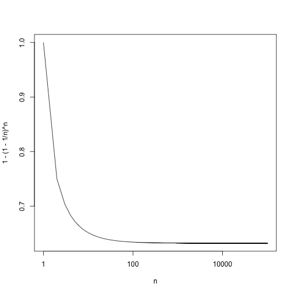
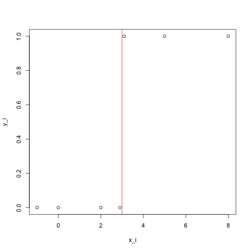

Homework 2 for STATS216 by Bruno Pen Wu
========================================

Question 1
----------

a) **iv. Steadily decrease.** As we allow *s* to get larger from 0, we are essentially increasing the budget allowed for the betas. As such, the complexity of the model will increase (since this is a lasso, the actual number of predictors will increase from 0 as *s* increases), allowing us to fit the model better to the training data. Therefore, the residual errors of the training model should decrease also.

b) **ii. Decrease initially, and then eventually start increasing in a U shape.** As *s* increases from 0, the complexity of the model will increase and again, since this is lasso, the number of predictors will increase as well. Initially, as the complexity (# of predictors) of the model increases, the test RSS should decrease. But later on, as more and more predictors are present, there will be more overfitting to the training data, so the test RSS will increase again, resulting in the U-shaped test RSS curve.

c) **iii. Steadily increase.** As *s* increases, complexity and number of predictors increase. This will lead to overfitting which increases the variance of the fit. 

d) **iv. Steadily decrease.** Increasing *s* leads to more complex model which will reduce the (squared) bias of the model since it will be better able to fit the training data.

e) **v. Remain constant.** The irreducilbe error (the variance of the error term $\mbox{Var}(\epsilon)$) is by definition independent of X (the predictors). Therefore, in theory, no matter how much we change the model fit (i.e. adjust the relationship between X and Y), the variance of this error term should remain constant.

Question 2
----------
a) With *n* observations, the chance that the *j* th observation *will* be the first bootstrap sample is $\frac{1}{n}$. So, **the chance that it will NOT be the first bootstrap sample is $1-\frac{1}{n}$.**

b) The chance that the jth observation will not appear as the second bootstrap observation would be the same as the chance that it'd not appear in the first observation (part a). Therefore, **the probability is also $1-\frac{1}{n}$.**

c) The probability that the *j* th observation is not the first observation in the bootstrap is $1-\frac{1}{n}$. The probability that the *j* th observation is not the first observation AND not the second observation in the bootstrap sample is $(1-\frac{1}{n})(1-\frac{1}{n})$. And so on. **Therefore, since there are *n* observations in the bootstrap sample in total, the probability that *j* th observation will not be in the bootrap sample at all will be $(1-\frac{1}{n})^n$.**

d) Here, we are looking at the probability that the *j* observation IS in the bootstrap sample. This would be 1 minus the probability calculated in part (c) or $1-(1-\frac{1}{n})^n$. For n=5, the calculation is:

```r
n = 5
1 - (1 - 1/n)^n
```

```
## [1] 0.6723
```


e) For n=100, the calculation is:

```r
n = 100
1 - (1 - 1/n)^n
```

```
## [1] 0.634
```


f) For n=10,000, the calculation is:

```r
n = 10000
1 - (1 - 1/n)^n
```

```
## [1] 0.6321
```


g) Create a plot function that uses the equation from part c. I've made the graph easier to see by using `log="x"` argument inside the`plot()` function.

```r
PlotProb = function(n) {
    plot(1 - (1 - 1/n)^n, log = "x", xlab = "n", type = "l")
}
PlotProb(1:1e+05)
```

 

**It's clear from the graph that the function $1-(1-\frac{1}{n})^n$ reaches an asymptote (of around 63% given the previous answers).**

h) Inputting code from the question:

```r
store = rep(NA, 10000)
for (i in 1:10000) {
    store[i] = sum(sample(1:100, rep = TRUE) == 4) > 0
}
mean(store)
```

```
## [1] 0.622
```

**As expected, with a large number of observations, the chance that a bootstrap sample will contain a particular data point from the original sample is about 2/3 - as demonstrated in the asymptotic function graph in part g.**

Question 3
----------
**a)** To show that the likelihood function $L(\beta_1,\beta_2) = \prod\limits_{i:y_i=1}p(x_i) \prod\limits_{i':y_{i'}=0}(1-p(x_{i'}))$ is strictly less than 1, we need to show that the two probability terms within the equation: $p(x_i)$ and $p(x_{i'})$ are strictly between 0 and 1. Because if these probabilities are always between 0 and 1, the likelihood equation will always be a product of fractions strictly between 0 and 1 - which means that it will always be strictly less than 1. 

The two probability terms have the same definition:

$p(X) = \frac{e^{\beta_0+\beta_1X}}{1+e^{\beta_0+\beta_1X}}$

We can look at what happens to $p(X)$ at extreme values of $\beta_0+\beta_1X$:
  1. When $\beta_0+\beta_1X \to \infty$, $p(X) \to 1$ since both the numerator and the denominator of $p(X)$ become very large and are essentially equal. 
  2. When $\beta_0+\beta_1X \to -\infty$, $p(X) \to 0$ since the numerator of $p(X)$ approaches 0.
  3. When $\beta_0+\beta_1X \to 0$, $p(X) \to 0.5$ as the numerator of $p(X)$ becomes 1 and its denominator becomes 2.

**As we can see from the above, $0 < p(X) < 1$ will always be true for any value of $\beta_0+\beta_1X$. Therefore, the likelihood function $L(\beta_1,\beta_2)$ will always be strictly less than 1.**

**b)** If all of the $x_i$ corresponding to $y_i=0$ are negative (and all the remaining $x_i$ are positive), then the conditional probability $P(Y=0 | X=x_i) = 1$. Why is this? Because in this case, for *any given value of $x_i$*, we can always predict with 100% certainty whether the corresponding Y is 0 or not. For example, if we are given a negative $x_i$ then we can say for sure that the corresponding $Y=0$ is true and if we are given a positive $x_i$, we can say for certain that $Y=0$ is not true. Either way, we are 100% certain of this conditional probability. Since there are only 2 classes in this case (Y=0 or Y=1), we can also say with 100% certainty whether Y=1 given any value of X. Hence, the conditional probability of Y=1 given any X is *ALSO* equal to 1 in this case: $P(Y=1 | X=x_i) = 1$.

In the likelihood function,

$L(\beta_1,\beta_2) = \prod\limits_{i:y_i=1}p(x_i) \prod\limits_{i':y_{i'}=0}(1-p(x_{i'}))$

The first term of $\prod\limits_{i':y_{i'}=0}(1-p(x_{i'}))$ is the conditional probability of Y=0 given $x_i$. And the second term of $\prod\limits_{i':y_{i'}=0}(1-p(x_{i'}))$ is the conditional probability of Y=1 given $x_i'$.

In this case, both of these product terms should be 1 as stated above.

$\prod\limits_{i:y_i=1}p(x_i) = P(Y=1 | X=x_i') = 1$

$\prod\limits_{i':y_{i'}=0}(1-p(x_{i'})) = P(Y=0 | X=x_i') = 1$

But we learned from part (a) that the likelihood function $L(\beta_1,\beta_2)$ is *STRICTLY less than 1* and that as $\beta_0+\beta_1X \to \infty$, $p(X) \to 1$ but *$p(X)$ never becomes 1*. $p(X)$ is the conditional probability and in logistic regression $p(X) = p(Y=1|X) = \frac{e^{\beta_0+\beta_1X}}{1+e^{\beta_0+\beta_1X}}$. So we can always find a set of $\hat{\beta_0}$ and $\hat{\beta_1}$ that gets $p(X)$ (and therefore the likelihood function $L(\beta_1,\beta_2)$) closer and closer to 1 but never reaches it.

**In this way, we are always able to "improve" our answer for the likelihood function (get it closer to 1). Hence, it is not possible to maximize the function under this condition to find a set of $\hat{\beta_0}$ and $\hat{\beta_1}$ that would be the best fit for the logistic regression. Therefore, $\hat{\beta_0}$ and $\hat{\beta_1}$ are undefined for this case.**

**c)** In part (b), we were dealing with a special case in which all of the $x_i$ corresponding to $y_i=0$ are negative ($x_i < 0$), with the remaining $x_i$ being positive ($x_i>0$). As mentioned in part b, this has the effect of making the conditional probabilities $P(Y=0 | X=x_i) = 1$ and $P(Y=1 | X=x_i') = 1$. But this "separator" value for $x_i$ doesn't need to be 0, it could be any constant $c$.

For example, if we were told that all of the $x_i$ corresponding to $y_i=0$ are less than three ($x_i < 3$). Then, if we are given an $x_i$ where $x_i<3$, we can say for certain that $Y=0$ is true and if we are given an $x_i$ where $x_i>3$, we can say for certain that $Y=1$ is true. 

**If the conditional probabilities $P(Y=0 | X=x_i) = 1$ and $P(Y=1 | X=x_i') = 1$ hold, then all the subsequent logic in part (b) for the likelihood function also applies. Thus, in all cases where there is a constant $c$ which can turn $x_i$ into a perfect separator for a class, the $\hat{\beta_0}$ and $\hat{\beta_1}$ will be undefined.**

**d)** Below is my own simple data set of the form mentioned in part c - all the $x_i$ corresponding to $y_i=0$ are less than 3 while all the remaining $x_i>3$ correspond to $y_i=1$. Hence, the separator constant $c=3$ in this case.


```r
y_i <- c(0, 0, 0, 0, 1, 1, 1)
x_i <- c(2.9, 2, 0, -1, 3.1, 5, 8)
plot(x_i, y_i)
abline(v = 3, col = "red")
```

 

```r
example <- data.frame(x_i, y_i)
glm(y_i ~ x_i, data = example, family = binomial)
```

```
## Warning: glm.fit: algorithm did not converge
## Warning: glm.fit: fitted probabilities numerically 0 or 1 occurred
```

```
## 
## Call:  glm(formula = y_i ~ x_i, family = binomial, data = example)
## 
## Coefficients:
## (Intercept)          x_i  
##        -617          206  
## 
## Degrees of Freedom: 6 Total (i.e. Null);  5 Residual
## Null Deviance:	    9.56 
## Residual Deviance: 4.67e-09 	AIC: 4
```


**So in this case, we do get warning messages telling us that we've fit a logistic regression to perfectly separable classes. And so the estimated coefficients are not meaningful here.**

Question 4
----------
For Question 4, I collaborated with **Seema Sangari** and **Sanne de Roever**.

Instead of recreating the wheel, we first started out with some data sets and functions from the in-class exercise. I load them here so that those data/functions are available for use later to answer the questions..


```r
# Load in data
games <- read.csv("http://www.stanford.edu/~wfithian/games.csv", as.is = TRUE)
teams <- read.csv("http://www.stanford.edu/~wfithian/teams.csv", as.is = TRUE)
all.teams <- sort(unique(c(teams$team, games$home, games$away)))

# Function to compute a team's total margin of victory
total.margin <- function(team) {
    with(games, sum(homeScore[home == team]) + sum(awayScore[away == team]) - 
        sum(homeScore[away == team]) - sum(awayScore[home == team]))
}

# Set y response variable for linear
y <- with(games, homeScore - awayScore)

## Construct a data frame of the right dimensions, with all zeros
X0 <- as.data.frame(matrix(0, nrow(games), length(all.teams)))
names(X0) <- all.teams

## Fill in the columns, one by one
for (tm in all.teams) {
    X0[[tm]] <- 1 * (games$home == tm) - 1 * (games$away == tm)
}

# We can effectively force j=0 for the j corresponding to Stanford by
# eliminating that column from the predictor matrix.
X <- X0[, names(X0) != "stanford-cardinal"]
reg.season.games <- which(games$gameType == "REG")

# Now, let's fit our model. There is no intercept in the model, so we
# explicitly exclude it from the formula mod <- lm(y ~ 0 + ., data=X,
# subset=reg.season.games)

# HOME COURT ADVANTAGE
homeAdv <- 1 - games$neutralLocation
homeAdv.mod <- lm(y ~ 0 + homeAdv + ., data = X, subset = reg.season.games)
homeAdv.coef <- coef(homeAdv.mod)[paste("`", teams$team, "`", sep = "")]
names(homeAdv.coef) <- teams$team

# Create a 'schedule' function to put any team's schedule into a good
# format:
schedule <- function(team, game.type) {
    home.sch <- with(games, games[home == team & gameType == game.type, c(1, 
        3, 4, 5)])
    away.sch <- with(games, games[away == team & gameType == game.type, c(1, 
        2, 5, 4)])
    names(home.sch) <- names(away.sch) <- c("date", "opponent", "score", "oppoScore")
    sch <- rbind(home.sch, away.sch)
    
    sch$margin <- with(sch, score - oppoScore)
    sch$oppoQuality <- homeAdv.coef[as.character(sch$opponent)]
    
    sch <- sch[order(sch$date), ]
    rownames(sch) <- NULL
    return(sch)
}
```


**a)** Now we can get started. For part a, we ran a logistic regression and took a look at the results.


```r
# Create new y response variable (binary home win=1/home loss=0)
y.wl <- with(games, ifelse(homeScore > awayScore, 1, 0))

# Logistic model using this new indicator (incl home adv & excl stanford &
# reg season games only)
homeAdv.mod.log <- glm(y.wl ~ 0 + homeAdv + ., data = X, subset = reg.season.games, 
    family = binomial)
homeAdv.coef.log <- coef(homeAdv.mod.log)[paste("`", all.teams, "`", sep = "")]
names(homeAdv.coef.log) <- all.teams

# Ranking according to the logistic regression
homeAdv.coef.log[order(homeAdv.coef.log, decreasing = TRUE)[1:20]]
```

```
##   saint-mary-saint-mary   st.-thomas-(tx)-celts        gonzaga-bulldogs 
##                  14.127                  13.270                   2.771 
##    louisville-cardinals         kansas-jayhawks        indiana-hoosiers 
##                   2.412                   2.266                   2.255 
##        new-mexico-lobos     ohio-state-buckeyes        duke-blue-devils 
##                   2.239                   2.137                   2.107 
##        georgetown-hoyas michigan-state-spartans     michigan-wolverines 
##                   2.032                   1.976                   1.960 
##   miami-(fl)-hurricanes   kansas-state-wildcats         syracuse-orange 
##                   1.761                   1.749                   1.605 
##          memphis-tigers   saint-louis-billikens marquette-golden-eagles 
##                   1.532                   1.522                   1.508 
##         butler-bulldogs       wisconsin-badgers 
##                   1.460                   1.451
```


We see that `saint-mary-saint-mary` and `st.-thomas-(tx)-celts` are at the top according to the logistic model. So we took a look at the schedules for these teams to see what's going on:


```r
schedule("saint-mary-saint-mary", "REG")  #saint-mary's regular season schedule
```

```
##         date                 opponent score oppoScore margin oppoQuality
## 1 2012-11-11 nebraska-omaha-mavericks    96        86     10      -23.95
```

```r
schedule("st.-thomas-(tx)-celts", "REG")  #st.-thomas's regular season schedule
```

```
##         date  opponent score oppoScore margin oppoQuality
## 1 2012-11-10 rice-owls    72        59     13      -22.19
```


We see that these teams only played 1 game each and therein lies the problem. From Question 3, we learned that **when two classes can be perfectly separated by a linear boundary, the estimated coefficients for the logistic regression is undefined.** Since for these two teams, there was only 1 game played (1 data point only), that one game acts as a perfect separator for the wins and losses. And so the conditional probabilities $P(Y=Win|X) = 1$ and $P(Y=Loss|X) = 1$. This means that we cannot use the estimated coefficients for these teams as they are undefined.

**b)** Now we will identify the teams that played less than 5 games during the season. Remove these teams and all the games that they played in (deleting columns and rows from the X variable). Then we'll refit both the logistic and linear regression models and compare the resulting rankings with the AP and USAT rankings.


```r
# Get index of games involving a team that played in less than 5 games.
gamelist = names(X[, which(colSums(abs(X), dims = 1) < 5)])
below5.teams.games <- which(games$away %in% gamelist | games$home %in% gamelist)

# Remove all teams that played in less than 5 games and all games that those
# teams played in
X1 <- X[-below5.teams.games, -which(colSums(abs(X), dims = 1) < 5)]
games2 = games[-below5.teams.games, ]  #Remove games involving teams that played less than 5

# Refit logistic model
y.wl2 <- with(games2, ifelse(homeScore > awayScore, 1, 0))  #reset y response based fewer games
homeAdv2 <- 1 - games2$neutralLocation  #reset HomeAdv based on fewer games
reg.season.games <- which(games2$gameType == "REG")  #reset regular season index based on fewer games
homeAdv.mod.log <- glm(y.wl2 ~ 0 + homeAdv2 + ., data = X1, subset = reg.season.games, 
    family = binomial)
homeAdv.coef.log <- coef(homeAdv.mod.log)[paste("`", teams$team, "`", sep = "")]
names(homeAdv.coef.log) <- teams$team

# Refit linear model
y2 <- with(games2, homeScore - awayScore)
homeAdv.mod.ln <- lm(y2 ~ 0 + homeAdv2 + ., data = X1, subset = reg.season.games)
homeAdv.coef <- coef(homeAdv.mod.ln)[paste("`", teams$team, "`", sep = "")]
names(homeAdv.coef) <- teams$team

# Compare Rankings
rank.table <- cbind(`Model Score` = homeAdv.coef, `Linear Model Rank` = rank(-homeAdv.coef, 
    ties = "min"), `Logistic Rank` = rank(-homeAdv.coef.log, ties = "min"), 
    `AP Rank` = teams$apRank, `USAT Rank` = teams$usaTodayRank)

rank.table[order(homeAdv.coef.log, decreasing = TRUE)[1:20], ]
```

```
##                         Model Score Linear Model Rank Logistic Rank
## gonzaga-bulldogs            10.0065                 4             1
## louisville-cardinals        12.1346                 3             2
## kansas-jayhawks              8.6315                 6             3
## indiana-hoosiers            13.2639                 1             4
## new-mexico-lobos             3.0084                23             5
## ohio-state-buckeyes          7.8906                 7             6
## duke-blue-devils             9.3997                 5             7
## georgetown-hoyas             4.3198                18             8
## michigan-state-spartans      6.1714                12             9
## michigan-wolverines          7.4970                 8            10
## miami-(fl)-hurricanes        5.2035                14            11
## kansas-state-wildcats        1.6536                36            12
## syracuse-orange              7.1383                10            13
## memphis-tigers               0.9509                43            14
## saint-louis-billikens        2.6402                26            15
## marquette-golden-eagles      2.3497                30            16
## butler-bulldogs             -0.7332                50            17
## wisconsin-badgers            6.8267                11            18
## florida-gators              12.6456                 2            19
## oklahoma-state-cowboys       3.6981                20            20
##                         AP Rank USAT Rank
## gonzaga-bulldogs              1         1
## louisville-cardinals          2         2
## kansas-jayhawks               3         3
## indiana-hoosiers              4         5
## new-mexico-lobos             11        10
## ohio-state-buckeyes           7         6
## duke-blue-devils              6         7
## georgetown-hoyas              8         8
## michigan-state-spartans       9         9
## michigan-wolverines          10        11
## miami-(fl)-hurricanes         5         4
## kansas-state-wildcats        12        14
## syracuse-orange              16        18
## memphis-tigers               19        15
## saint-louis-billikens        13        13
## marquette-golden-eagles      15        16
## butler-bulldogs              NA        NA
## wisconsin-badgers            18        17
## florida-gators               14        12
## oklahoma-state-cowboys       17        19
```


From the ranking comparison, we can see that **the logistic model corresponds much better to the viewer's polls (AP and USAT rankings) than the linear model.** This means that both the AP and USAT rankings place a much higher emphasis on wins and losses than on margins of victory.

**c)** We compare the fraction of teams that have p<0.05 for both the logistic and linear models.

Fraction of teams for which we are confident (p<0.05) are better or worse than Stanford for the linear model:

```r
(sum(summary(homeAdv.mod.ln)$coefficients[, 4] < 0.05) - 1)/ncol(X1)  #X1 does not contain homeAdv column
```

```
## [1] 0.7746
```


Fraction of teams for which we are confident (p<0.05) are better or worse than Stanford for the logistic model:

```r
(sum(summary(homeAdv.mod.log)$coefficients[, 4] < 0.05) - 1)/ncol(X1)
```

```
## [1] 0.6185
```


**It is clear here that the given the information loss in the logistic regression, the linear model resulted in a higher number of predictors that are significant.**

**d)** Next we ran the 10-fold cross validation analysis for both the logistic and the linear models. Obtain the contingency tables and also the cross-validation training error rates for both logistic and linear regressions for each of the 10-fold CV. The details of the procedures are documented in the code itself below. The resultant summary contingency table is displayed.


```r
# 10-fold CV for each model
k = 10
ntrain = nrow(X1)
foldid = rep(1:k, length = ntrain)
set.seed(1000)
foldid = sample(foldid)

# Include homeAdv(with fewer games) into the X variable matrix
X2 = data.frame(X1, homeAdv2)

# Initialize variables for calculating cv errors and storing contingency
# tables
cv.err.log = rep(0, 10)
cv.err.ln = rep(0, 10)
T = list()

for (i in 1:k) {
    # define test and training sets
    test = foldid == i
    train = foldid != i
    
    # Logistic model predictions
    homeAdv.mod.log <- glm(y.wl2 ~ 0 + homeAdv2 + ., data = X2, subset = train, 
        family = binomial)
    homeAdv.log.probs <- predict(homeAdv.mod.log, newdata = data.frame(X2[test, 
        ]), type = "response")
    homeAdv.log.pred = ifelse(homeAdv.log.probs > 0.5, 1, 0)
    cv.err.log[i] = mean(homeAdv.log.pred != y.wl2[test])
    
    # Linear model prediction (if winning margin > 0 then predict a win)
    homeAdv.mod.ln <- lm(y2 ~ 0 + homeAdv2 + ., data = X2, subset = train)
    homeAdv.ln.margins <- predict(homeAdv.mod.ln, newdata = data.frame(X2[test, 
        ]))
    homeAdv.ln.pred = ifelse(homeAdv.ln.margins > 0, 1, 0)
    cv.err.ln[i] = mean(homeAdv.ln.pred != y.wl2[test])
    
    # Compare predicted results to actual for both models and build a
    # contingency table for each fold. Store each contingency table into a list
    # which can then be added later for the final table.
    T[[i]] <- table(homeAdv.ln.pred == y.wl2[test], homeAdv.log.pred == y.wl2[test])
}
```


Below is the summary contingency table:

```r
Contingentable = Reduce("+", T)
Contingentable
```

```
##        
##         FALSE TRUE
##   FALSE  1150  226
##   TRUE    261 3829
```


The summary contingency table is for all test samples across all 10-fold cross validations. The columns of the table represent cases for which the logistic model's prediction for the home team matches the actual outcome ("True") and where its prediction does not match the actual outcome ("False"). The rows of the table represent cases for which the linear model's prediction for the home team matches the actual outcome ("True") and where its prediction does not match the actual outcome ("False"). 

Below are the 10-fold cross validation error results for the logistic and linear model:

```r
# Cross validation error rate for the logistic model:
mean(cv.err.log)
```

```
## [1] 0.2581
```

```r
# Cross validation error rate for linear model:
mean(cv.err.ln)
```

```
## [1] 0.2517
```


**The cross-validation errors for both models are quite similar and so we cannot say that one model is better than the other based on the test error rates.**

**e)** We take a look at $n_{12}$ and $n_{21}$ here and ran the *McNemar's test*.


```r
# Get D from summing n12 and n21
D = Contingentable[1, 2] + Contingentable[2, 1]
# 95% confidence interval for D using normal approximation
low_end = D/2 - 2 * sqrt(D)/2
high_end = D/2 + 2 * sqrt(D)/2
# Low end of 95% confidence interval for D
low_end
```

```
## [1] 221.4
```

```r
# High end of 95% confidence interval for D
high_end
```

```
## [1] 265.6
```

```r
# n12
Contingentable[1, 2]
```

```
## [1] 226
```

```r
# n21
Contingentable[2, 1]
```

```
## [1] 261
```


Because both $n_{12}$ and $n_{21}$ are within the 95% confidence interval of $D$, we can say (for this instance of the 10-fold cross-validation) that both models seemed equally good at predicting games. 

But these values are quite near the boundaries of the 95% interval and so we ran the 10-fold cross validation again using different initial seed settings. We found that for some other 10-fold cross validations (such as when set.seed(200)), both $n_{12}$ and $n_{21}$ are out of bound of this confidence interval.

**Therefore, our conclusion is that we cannot say with certainty whether both models are equally good at predicting the games nor can we say with certainty that one model is better than the other at predicting the games.**

This corresponds with the results from part (d) that the test errors for both models were very similar.
