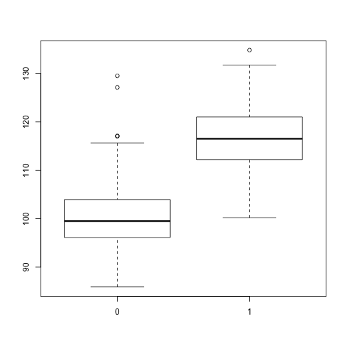
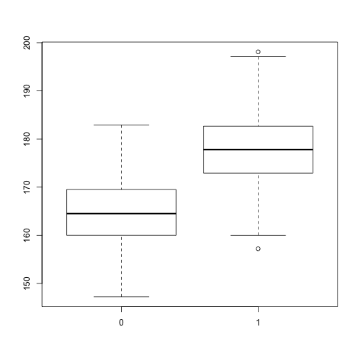
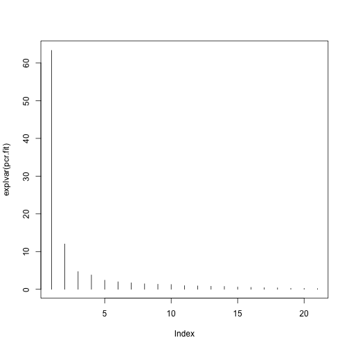
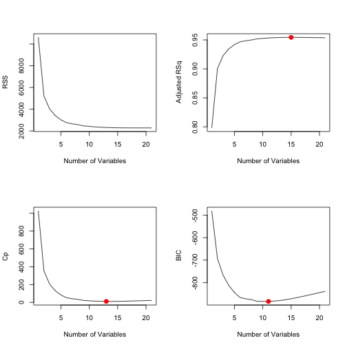
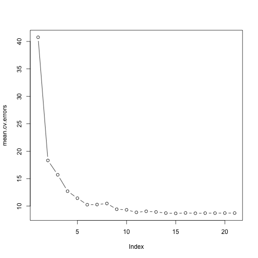

Homework 3 for STATS216 by Bruno Pen Wu
========================================

Question 1
----------

a) **Best subset selection has the smallest training RSS.** Best subset selection is guaranteed to find the model with the lowest training RSS (best fit) since it will go through every possible subset of predictors. While the other two methods do not iterate through every subset of predictors and might miss the model with the lowest training RSS.

b) **In the absence of additional information, it is impossible to tell which method will yield the smallest test RSS.** While the best subset selection is guaranteed to find the model with the lowest *training* RSS, this might return a model that overfits the data and thus result in a higher test RSS. Also, the other methods might select a model with lower test RSS just by chance if the test data happen to fit them better. 

c) 

i. **True.**

ii. **True.**

iii. **False.**

iv. **False.**

v. **False.**


Question 2
----------
a) 


Question 3
----------
I worked with **Seema Sangari, Sanne de Roever, and Vedat Can Cologlu** on this question.


```r
load("~/Dropbox/Data Science/STATS216/Inclass Material/Feb 12/body.RData")
boxplot(X$Shoulder.Girth ~ Y$Gender)
```

 

```r
boxplot(Y$Height ~ Y$Gender)
```

 

# We can run couple of side by side boxplots. We expect men to be taller and have wider shoulders on average.
# Looking at these boxplots, we can infer that Gender=1 represents men.


#b)

```r
library(pls)
```

```
## 
## Attaching package: 'pls'
## 
## The following object is masked from 'package:stats':
## 
##     loadings
```

```r

# Let's combine Y$weight into X to create one combined data frame. It will
# make rest of the problem easier.
X <- cbind(Y$Weight, X)
colnames(X)[1] <- "Weight"

# It appears all male measurements at the top of our data, and all female at
# the bottom. Let's mix it up first.
set.seed(11)
X <- X[sample(nrow(X)), ]

# Let's run pcr and plsr
X.training <- X[1:307, ]
X.test <- X[308:507, ]


set.seed(2)
pcr.fit = pcr(Weight ~ ., data = X.training, scale = TRUE, validation = "CV")

set.seed(1)
pls.fit = plsr(Weight ~ ., data = X.training, scale = TRUE, validation = "CV")

# Scaling makes sense because not all units of X features are on the same
# scale.  It is true that most features are in 'cm'; however they still have
# different variance/characteristic (chest variance is different than wrist
# variance)
```


#c)

```r
summary(pcr.fit)
```

```
## Data: 	X dimension: 307 21 
## 	Y dimension: 307 1
## Fit method: svdpc
## Number of components considered: 21
## 
## VALIDATION: RMSEP
## Cross-validated using 10 random segments.
##        (Intercept)  1 comps  2 comps  3 comps  4 comps  5 comps  6 comps
## CV           13.15    3.347    3.268    3.078    3.070    3.060    3.060
## adjCV        13.15    3.345    3.265    3.075    3.066    3.055    3.055
##        7 comps  8 comps  9 comps  10 comps  11 comps  12 comps  13 comps
## CV       3.040    3.020    3.037     3.052     3.067     3.065     3.069
## adjCV    3.036    3.012    3.035     3.045     3.062     3.057     3.059
##        14 comps  15 comps  16 comps  17 comps  18 comps  19 comps
## CV        3.075     3.045     2.928     2.932     2.940     2.947
## adjCV     3.067     3.032     2.917     2.921     2.928     2.936
##        20 comps  21 comps
## CV        2.959     2.975
## adjCV     2.947     2.962
## 
## TRAINING: % variance explained
##         1 comps  2 comps  3 comps  4 comps  5 comps  6 comps  7 comps
## X         63.33    75.33    80.04    83.84    86.24    88.23    89.93
## Weight    93.62    93.93    94.64    94.72    94.85    94.85    94.92
##         8 comps  9 comps  10 comps  11 comps  12 comps  13 comps  14 comps
## X         91.39    92.73     94.00     94.96     95.85     96.66     97.41
## Weight    95.01    95.01     95.08     95.08     95.13     95.16     95.17
##         15 comps  16 comps  17 comps  18 comps  19 comps  20 comps
## X          98.01     98.52     98.93     99.31     99.58     99.82
## Weight     95.34     95.65     95.66     95.66     95.67     95.67
##         21 comps
## X         100.00
## Weight     95.69
```

```r
summary(pls.fit)
```

```
## Data: 	X dimension: 307 21 
## 	Y dimension: 307 1
## Fit method: kernelpls
## Number of components considered: 21
## 
## VALIDATION: RMSEP
## Cross-validated using 10 random segments.
##        (Intercept)  1 comps  2 comps  3 comps  4 comps  5 comps  6 comps
## CV           13.15    3.287    3.060    2.974    2.978    2.968    2.968
## adjCV        13.15    3.285    3.057    2.971    2.967    2.956    2.955
##        7 comps  8 comps  9 comps  10 comps  11 comps  12 comps  13 comps
## CV       2.968    2.972    2.977     2.983     2.982     2.982     2.982
## adjCV    2.956    2.959    2.964     2.969     2.969     2.969     2.968
##        14 comps  15 comps  16 comps  17 comps  18 comps  19 comps
## CV        2.981     2.981     2.981     2.981     2.981     2.981
## adjCV     2.968     2.968     2.968     2.968     2.968     2.968
##        20 comps  21 comps
## CV        2.981     2.981
## adjCV     2.968     2.968
## 
## TRAINING: % variance explained
##         1 comps  2 comps  3 comps  4 comps  5 comps  6 comps  7 comps
## X         63.32    72.69    79.44    81.49    83.63    86.20    88.10
## Weight    93.87    94.81    95.22    95.54    95.64    95.67    95.68
##         8 comps  9 comps  10 comps  11 comps  12 comps  13 comps  14 comps
## X         89.19    90.20     91.12     92.50     93.54     94.62     95.18
## Weight    95.68    95.69     95.69     95.69     95.69     95.69     95.69
##         15 comps  16 comps  17 comps  18 comps  19 comps  20 comps
## X          95.80     96.33     97.55     98.19     98.68     99.26
## Weight     95.69     95.69     95.69     95.69     95.69     95.69
##         21 comps
## X         100.00
## Weight     95.69
```

```r

# First few components explain most of the variance in the data. That's not
# surprisin to see.  Marginal contribution of additional components after
# 4th or 5th component is not much, and it keeps getting smaller.
```


```r
# d) We can plot the varieance explained by each component. We pick a value
# up to a point that we see a drop off.  We think 2 or 4 is reasonable for
# PCR. We will go wtih 4.  We think 3 is reasonable for PLS.

plot(explvar(pcr.fit), type = "h")
```

 

```r
plot(explvar(pls.fit), type = "h")
```

 


```r
# E) No, PLS and PCR use all 21 features. It created Principal components
# from them, but individual predictos are not necessarily dropped out of the
# model. We need a subset selction model for this purpose. We can use a best
# subset method given that we only have 21 parameters. Then apply, CV.
library(leaps)
regfit.full <- regsubsets(Weight ~ ., data = X.training, nvmax = 21)
reg.summary <- summary(regfit.full)

par(mfrow = c(2, 2))
plot(reg.summary$rss, xlab = " Number of Variables ", ylab = " RSS", type = "l")
plot(reg.summary$adjr2, xlab = " Number of Variables ", ylab = " Adjusted RSq", 
    type = "l")

which.max(reg.summary$adjr2)
```

```
## [1] 15
```

```r

# Adj R2 suggest selection of 15 variables
points(15, reg.summary$adjr2[15], col = "red", cex = 2, pch = 20)


# lets use cp and bic
plot(reg.summary$cp, xlab = " Number of Variables ", ylab = "Cp", type = "l")
which.min(reg.summary$cp)
```

```
## [1] 13
```

```r

points(13, reg.summary$cp[13], col = "red", cex = 2, pch = 20)
which.min(reg.summary$bic)
```

```
## [1] 11
```

```r

plot(reg.summary$bic, xlab = " Number of Variables ", ylab = " BIC", type = "l")
points(11, reg.summary$bic[11], col = "red", cex = 2, pch = 20)
```

 

```r

# Cp chose 13, and BIC chooses 11.

# Let's do CV. WE will only use training data.

predict.regsubsets = function(object, newdata, id, ...) {
    form = as.formula(object$call[[2]])
    mat = model.matrix(form, newdata)
    coefi = coef(object, id = id)
    xvars = names(coefi)
    mat[, xvars] %*% coefi
}


k = 10
set.seed(1)

folds <- sample(1:k, nrow(X.training), replace = TRUE)
cv.errors = matrix(NA, k, 21, dimnames = list(NULL, paste(1:21)))

for (j in 1:k) {
    best.fit <- regsubsets(Weight ~ ., data = X.training[folds != j, ], nvmax = 21)
    for (i in 1:21) {
        pred = predict(best.fit, X.training[folds == j, ], id = i)
        cv.errors[j, i] = mean((X.training$Weight[folds == j] - pred)^2)
    }
}


mean.cv.errors = apply(cv.errors, 2, mean)
mean.cv.errors
```

```
##      1      2      3      4      5      6      7      8      9     10 
## 40.764 18.317 15.702 12.719 11.437 10.251 10.280 10.471  9.424  9.318 
##     11     12     13     14     15     16     17     18     19     20 
##  8.862  9.049  8.929  8.727  8.674  8.748  8.693  8.719  8.718  8.727 
##     21 
##  8.729
```

```r
which.min(mean.cv.errors)
```

```
## 15 
## 15
```

```r

par(mfrow = c(1, 1))
plot(mean.cv.errors, type = "b")
```

 

```r

# Looking at CV with 10 folds we should use best subset with 15 predictors.
# Let's fit the full training set with two predictors to full set.
regfit.best <- regsubsets(Weight ~ ., data = X.training, nvmax = 15)
reg.summary <- summary(regfit.best)
coef(regfit.best, 15)
```

```
##     (Intercept)      Wrist.Diam   Forearm.Girth      Elbow.Diam 
##      -102.02548         0.41856         0.45131         0.39543 
##  Shoulder.Girth Biacromial.Diam     Chest.Depth     Chest.Girth 
##         0.16322         0.35174         0.41567         0.15413 
##     Navel.Girth     Waist.Girth  Pelvic.Breadth       Hip.Girth 
##        -0.06678         0.25426         0.25142         0.26498 
##     Thigh.Girth       Knee.Diam      Knee.Girth      Ankle.Diam 
##         0.28429         0.29372         0.65275         0.30863
```

```r

# So we actually need only 15 predictors according to best subset model and
# we can drop the other 6 predictors from the experiment.
predSubsetReg <- rep(0, 200)
for (i in 1:200) {
    predSubsetReg[i] <- predict(regfit.best, X.test[i, ], id = 15)
}
```


```r
library(pls)  # to use predict from this library

predPCR <- rep(0, 200)
for (i in 1:200) {
    predPCR[i] <- predict(pcr.fit, X.test[i, ], ncomp = 4)
}


predPLS <- rep(0, 200)
for (i in 1:200) {
    predPLS[i] <- predict(pls.fit, X.test[i, ], ncomp = 3)
}


pcr.MSE <- mean((predPCR - X.test$Weight)^2)
pls.MSE <- mean((predPLS - X.test$Weight)^2)
subsetReg.MSE <- mean((predSubsetReg - X.test$Weight)^2)
table(pcr.MSE, pls.MSE, subsetReg.MSE)
```

```
## , , subsetReg.MSE = 7.09782760143878
## 
##                   pls.MSE
## pcr.MSE            7.39266909908157
##   7.74786880019115                1
```

```r

## Looking at test set MSE, the best model is best subset selection. It uses
## 15 predictors, and has a MSE of 7.098)
```


